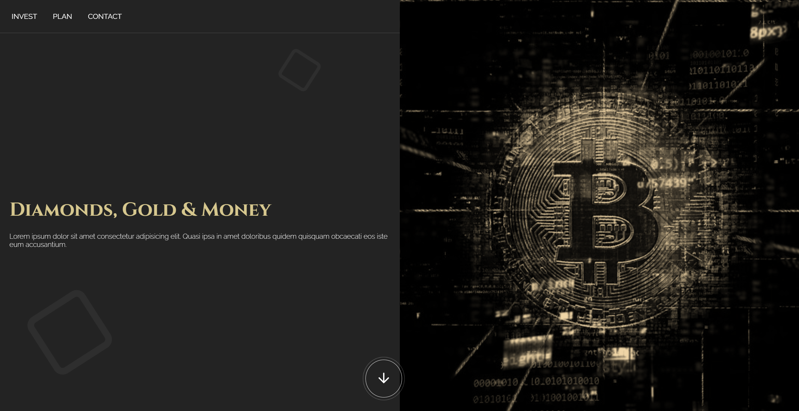

# ✨ DG&M Corporation Website - Investment Solutions

**Welcome to the DG&M Corporation website, a platform showcasing our investment solutions in diamonds, gold, and money.** This project focuses on providing a clear and informative user experience for potential investors.

## Project Overview

**Objective:** Develop a well-structured, informative website that effectively communicates DG&M Corporation's investment opportunities and highlights the benefits of choosing our services.

### Key Features

* **Clarity and Information:** The website prioritizes clear and concise information about each investment option.
* **Responsive Design:** Ensures optimal display across various devices, allowing users to access investment details comfortably on any screen size.
* **Compelling Design:** A professional and trustworthy design scheme fosters user confidence and builds brand credibility.

### Additional Highlights

* **Investment Options:** Dedicated sections detail investment plans for diamonds, gold, and money, allowing users to explore specific opportunities.
* **Benefits and Profitability:** Each investment section emphasizes potential gains and highlights the advantages of choosing DG&M Corporation.
* **User-Friendly Navigation:** A clear and intuitive navigation menu allows users to explore different sections of the website effortlessly.
* **Contact Form:** A contact form simplifies communication for potential investors seeking further information or inquiries.

## Local Setup

If you'd like to run the website locally, follow these steps:

1. **Clone this repository** to your local machine.
2. **Navigate to the project folder**.
3. **Open the `index.html` file** in your preferred web browser.

Now you can explore the DG&M Corporation website from your own computer!

## Contributing

While this website serves as a core structure, feel free to **customize it further** to better represent DG&M Corporation's brand identity and specific investment offerings.

---

**Happy building! 🚀🌐**
